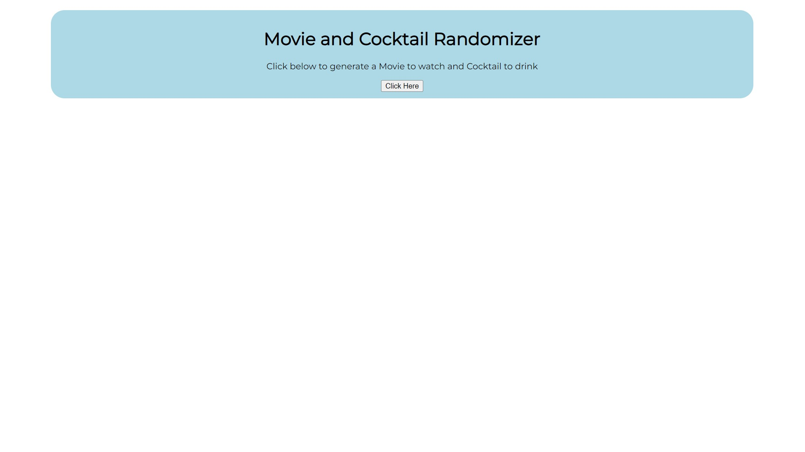
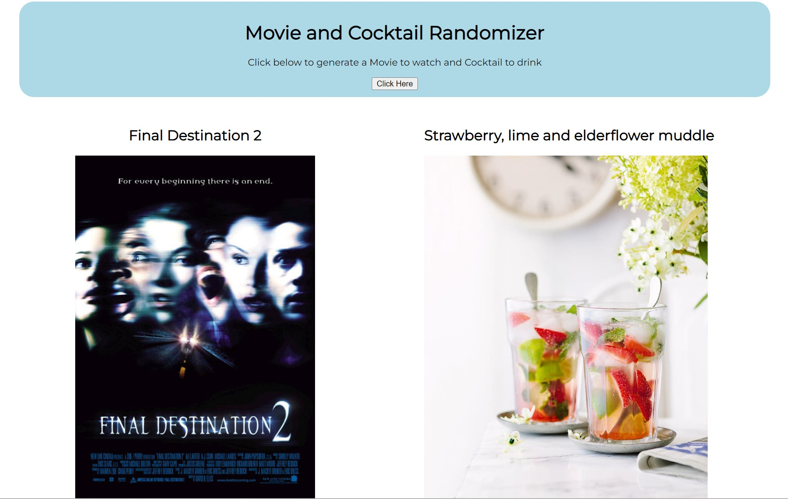

# Team Zona

## Description
We decided to utilize movie titles since at the beginning of our project our team, Zona, bonded over movie and specific movie titles.  This lead us to start developing a application that involved movies.  We build this product initially to see what movies were available with specific streaming services. We didn't find a public API that displayed the information of which movies were available in an individual streaming service. We switched to generating a random cocktail to enjoy while watching the movie.  This solves the inconvience of having to choose a movie yourself and having to decide what drink to have with that movie.  We learned how to implement an API and how to drill into it's package for specific data endpoints. 

## User Story
```
AS A developer 
I WANT a Movie and Drink Generator
SO THAT I can minimize the time to choose for people who are indecisive. 
```

## Installation
First, clone the code from the repository linked, https://github.com/Ruben04Derksen/Zona , then use the git clone command in your terminal with your respective code editor.  Finally open the HTML file in your browser and enjoy the application.

## Usage
Our application is simple to use and instructions can be found in our website. To use the applicaiton simply click the "Click Here" button.  Once the button is clicked, our application generates a random Movie title and Cocktail drink.



## Credits
- Tiffany Reed; https://github.com/tiffanyreed
- Carlos DLT https://github.com/crlsedlt42
- Ruben Derksen https://github.com/Ruben04Derksen
